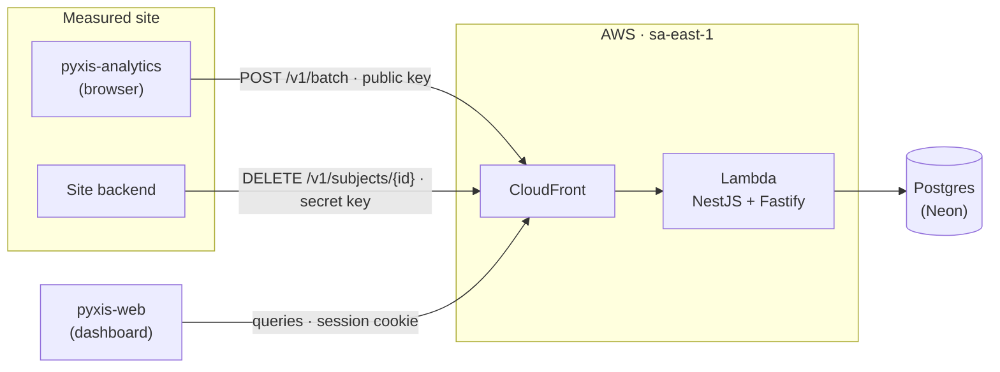
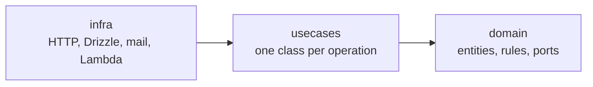

<div align="center">

<picture>
  <source media="(prefers-color-scheme: dark)" srcset=".github/assets/cover-dark.png">
  
</picture>

**The API of Pyxis: it receives product analytics events from the browser, answers the dashboard's
queries and erases a person's events on request, without cookies or personal data.**

[](https://github.com/samuelcsantana/pyxis-api/actions/workflows/ci.yml)
[](https://codecov.io/gh/samuelcsantana/pyxis-api)
[](https://github.com/samuelcsantana/pyxis-api/actions/workflows/codeql.yml)
<br>
[](LICENSE)
[](tsconfig.json)
[](https://www.conventionalcommits.org)

</div>

> **Status:** early development. The service skeleton, its quality gates and the OpenAPI export are
> in place; event ingestion is the next milestone (see [Roadmap](#roadmap)).

## Ecosystem

| Repository                                               | Role                                                            |
| -------------------------------------------------------- | --------------------------------------------------------------- |
| **pyxis-api** (this one)                                 | Ingestion, dashboard sign-in and queries, erasure, retention    |
| [pyxis-sdk](https://github.com/samuelcsantana/pyxis-sdk) | Browser tracker published to npm as `pyxis-analytics`           |
| [pyxis-web](https://github.com/samuelcsantana/pyxis-web) | The dashboard: overview, funnels, features, requests, timelines |

## Why it exists

Most analytics products ask a site to trade its visitors' privacy for insight: third-party
cookies, fingerprinting, raw IP addresses, full URLs with personal data in them. Pyxis answers the
questions a product team actually asks (which features are used, where requests fail, where a
sign-up funnel loses people, what one person did in order) while storing **no cookie, no IP
address, no user agent and no personal data**. Every rule is enforced in code and covered by
tests, not left to a policy page.

## Features

Shipping now:

- Health endpoint, strict security headers and a request id on every response
- OpenAPI 3.1 document generated from the routes' own Zod schemas, with Swagger UI outside
  production

Planned for v1 (see [Roadmap](#roadmap)):

- `POST /v1/batch`: batched ingestion with a public project key, a per-project origin allowlist,
  rate limits, deduplication and a server-side barrier that drops anything that looks like an
  email, a phone number or a tax id
- Device, browser and country derived on the server; the user agent and the address are never
  stored
- Dashboard sign-in by email code, with sessions checked on every request
- Queries for the overview, funnels, features, request errors, devices, acquisition and timelines
- `DELETE /v1/subjects/{userId}`: erases a person's events, including the anonymous part of the
  visit they signed up in
- Automatic deletion of events older than 13 months

## Architecture



Inside the service, dependencies point inward ([ADR 0002](docs/adr/0002-clean-architecture.md)):



## Tech stack

TypeScript 6 (strict) · NestJS 12 on Fastify 5 · Zod 4 · Drizzle ORM and PostgreSQL (from the
database milestone) · AWS Lambda behind CloudFront, provisioned with Terraform · Jest · GitHub
Actions with CodeQL, Dependabot, Codecov and release-please.

## Getting started

Requirements: Node.js 24 and npm 11.

```bash
git clone git@github.com:samuelcsantana/pyxis-api.git
cd pyxis-api
npm ci
npm run build
npm start
curl http://localhost:3040/health          # {"status":"ok"}
```

Swagger UI is at <http://localhost:3040/docs>. Configuration is validated at boot
([`src/config/env.schema.ts`](src/config/env.schema.ts)):

| Variable          | Default       | Meaning                                                     |
| ----------------- | ------------- | ----------------------------------------------------------- |
| `PORT`            | `3040`        | HTTP port                                                   |
| `NODE_ENV`        | `development` | `development`, `production` or `test`                       |
| `SWAGGER_ENABLED` | unset         | `true`/`false`; unset means on everywhere except production |

With Docker: `docker build -t pyxis-api . && docker run -p 3040:3040 pyxis-api`.

## Testing

```bash
npm run test:cov       # unit tests, 100% coverage required
npm run test:e2e       # the application over HTTP
npm run test:tooling   # the lint rule and the comment check
```

Coverage must stay at **100% of statements, branches, functions and lines**; CI fails below it.
Files outside the measurement, and why:

| Excluded                    | Reason                                                                 |
| --------------------------- | ---------------------------------------------------------------------- |
| `src/main.ts`               | Process entry point: wires the app and listens; the e2e suite boots it |
| `src/export-openapi.ts`     | Command-line entry point; CI runs it and checks its output             |
| `src/**/*.module.ts`        | Nest module declarations: wiring without logic                         |
| `eslint-rules/`, `scripts/` | Tooling outside `src/`, tested on Node's test runner instead           |

Integration tests against a real Postgres arrive with the database milestone.

## Project structure

```text
src/
├── config/            environment validation (Zod)
├── infra/http/        Fastify setup, security headers, request id, health, OpenAPI
├── main.ts            HTTP entry point
└── export-openapi.ts  writes openapi/openapi.json
test/e2e/              the application over HTTP
openapi/openapi.json   the published contract, regenerated by npm run openapi:export
eslint-rules/          the local no-comments ESLint rule
scripts/               the comment check for files ESLint does not read
docs/adr/              architecture decision records
```

`domain/`, `usecases/` and `test-utils/` appear with the first business rules.

## Contract

`openapi/openapi.json` is the source of truth for the other two repositories: the SDK and the
dashboard copy it from `main` and test against it. CI regenerates it on every pull request and
fails when the committed file differs from the code ([ADR 0003](docs/adr/0003-openapi-from-zod.md)).

## Privacy and security

- No cookies on ingestion, no personal data in events, IP address and user agent never stored
- Strict response headers: a CSP that loads nothing, no framing, nosniff, no referrer, HSTS and
  `no-store` by default
- `X-Forwarded-For` is never trusted for the client address
- Secrets live in AWS Parameter Store, never in the repository; secret scanning and push protection
  are on
- Vulnerabilities: see [SECURITY.md](SECURITY.md)

## Architecture decisions

| ADR                                                    | Decision                                   |
| ------------------------------------------------------ | ------------------------------------------ |
| [0001](docs/adr/0001-record-architecture-decisions.md) | Record architecture decisions              |
| [0002](docs/adr/0002-clean-architecture.md)            | Clean Architecture with ports and adapters |
| [0003](docs/adr/0003-openapi-from-zod.md)              | Generate the OpenAPI 3.1 contract from Zod |

## Roadmap

- [x] Service skeleton, quality gates, OpenAPI export
- [ ] Database: Drizzle, migrations, least-privilege roles, local Postgres
- [ ] Ingestion: domain rules, `POST /v1/batch`, project and key scripts
- [ ] Deployment: Lambda, CloudFront and Terraform
- [ ] Dashboard sign-in and queries
- [ ] Erasure and retention
- [ ] Load test, database size alarm, API reference on GitHub Pages

## Contributing and license

See [CONTRIBUTING.md](CONTRIBUTING.md) and the [Code of Conduct](CODE_OF_CONDUCT.md). Released
under the [MIT License](LICENSE).
